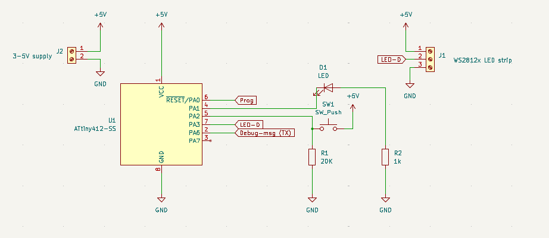
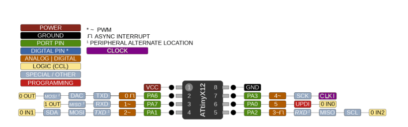

# ATtiny412 WS2812B Multi-Function LED Controller

A memory-optimized, bare-metal firmware for the **ATtiny412** microcontroller to drive up to **180 WS2812B / NeoPixel LEDs** using a single multi-function pushbutton. 

Designed for ultra-low SRAM environments (256 bytes total), the firmware utilizes **virtual tiling** and custom bit-bang streaming to repeat a 20-pixel pattern block across the full strip without running out of RAM.

All user settings (color, effect, and brightness) are bit-packed into a single byte and saved to EEPROM using a 10-second deferred write delay to maximize chip lifespan.

---

## Features

- **Virtual Tiling (180 LEDs on 256B RAM):** Allocates a 60-byte SRAM buffer (20 virtual pixels) and streams it 9 times continuously down the data wire without triggering a WS2812 reset latch.
- **Single Click:** Cycle through 8 preset colors (*Red, Yellow, Green, Cyan, Blue, Magenta, White, Warm White*).
- **Double Click:** Cycle through 8 animation modes:
  0. **Solid Color**
  1. **20-Pixel Chase**
  2. **10-Pixel Spaced Chase**
  3. **Breathing Pulse**
  4. **Alternating Blink**
  5. **Full Strip Blink**
  6. **Rainbow Spectrum Shift**
  7. **Smooth White Sparkle Fade** (Fades random LEDs smoothly to pure White at master strip brightness)
- **Long Press:** Smoothly ramps brightness in 5% steps (1% to 100%, alternating direction). Default startup brightness set to **50%** for power safety.
- **Smart EEPROM Save:** Bit-packs color, effect, and brightness into **1 byte** and commits after 10 seconds of button inactivity to prevent EEPROM wear.

***Optional***
- **Status LED:** Visual feedback for button presses on Pin 4 (`PA1`).
- **Serial Debugging:** Transmits telemetry at 115200 baud on Pin 2 (`PA6`) via `#define ENABLE_SERIAL`.

---

## Circuit Schematic & Connections

### Hardware Pinout

| Physical Pin | AVR Pin | Function | Wiring Details |
| :---: | :---: | :--- | :--- |
| **1** | `VCC` | Power Supply | Connected to **+5V DC Power Rail** |
| **2** | `PA6` | (Serial TX) | ***Optional*** Debug output to USB-Serial Adapter RX |
| **3** | `PA7` | Unused | *Unconnected* |
| **4** | `PA1` | (Status LED) | ***Optional*** Anode (+) to Pin 4, Cathode (-) via 1kΩ Resistor to GND |
| **5** | `PA2` | Pushbutton | Button Pin 1 to **+5V**; Button Pin 2 to Pin 5 & **20kΩ Pull-down Resistor** to GND |
| **6** | `PA0` | UPDI | UPDI Programming Header |
| **7** | `PA3` | WS2812B Data | Connected directly to `DIN` on LED strip |
| **8** | `GND` | Ground | Connected to **Common Ground Rail (GND)** |

---

## Hardware Requirements

1. **ATtiny412** Microcontroller (SOIC-8 package)
2. **WS2812B LED Strip** (Up to 180 LEDs, powered by external +5V DC)
3. **1× Momentary Pushbutton**
4. **1× 20kΩ Resistor** (External pull-down for button)

***Optional***

5. **1× 1kΩ Resistor** (Current limiting for Status LED)
6. **1× Standard LED** (Status indicator)

---

## Build & Flash Instructions

1. Open `attiny412_LEDStrip_Ctrl.ino` in the **Arduino IDE**.
2. Install **megaTinyCore** via the Arduino Board Manager.
3. Configure target board settings:
   - **Board:** ATtiny412 / 402 / 212 / 202
   - **Clock:** 16 MHz or 20 MHz internal

***Optional***

4. **Upload Firmware:** Upload the compiled binary using a **SerialUPDI** or **jtag2updi** programmer connected to Pin 6 (`PA0`).
5. **Enable/Disable Serial Debugging:** Line 23 of the sketch contains `#define ENABLE_SERIAL`. Keep this line active to stream telemetry at 115200 baud on Pin 2 (`PA6`). Comment it out (`// #define ENABLE_SERIAL`) to disable debug output, save Flash memory, and reduce execution overhead.